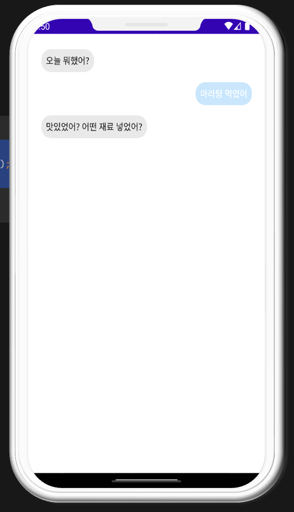
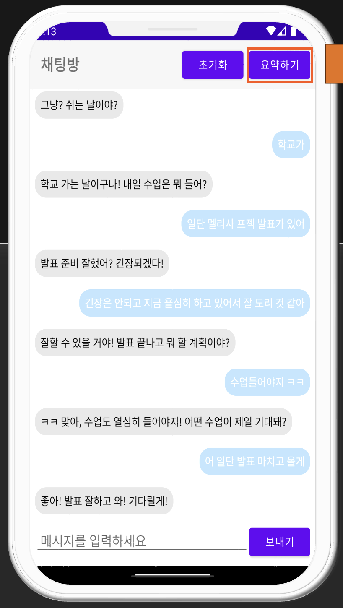
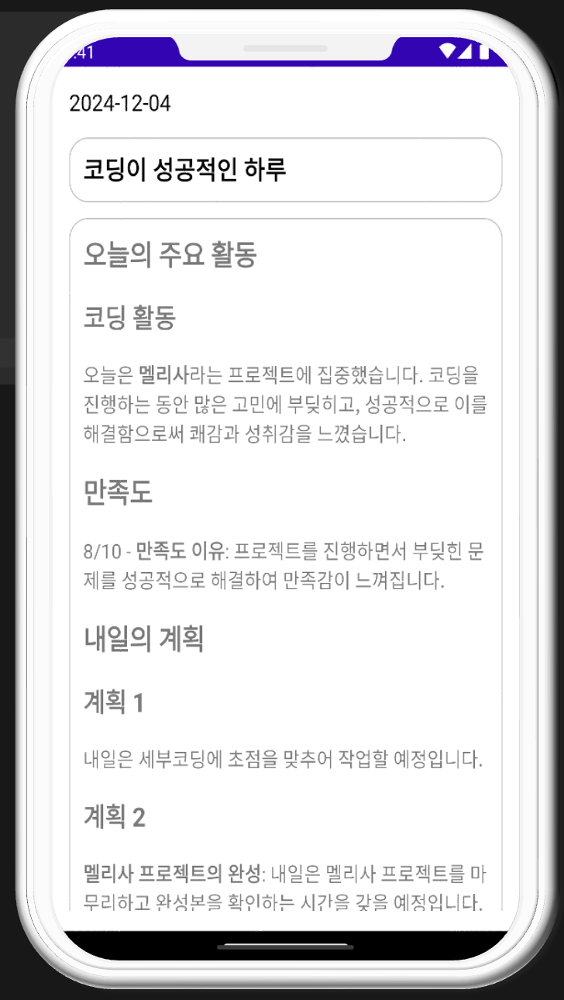
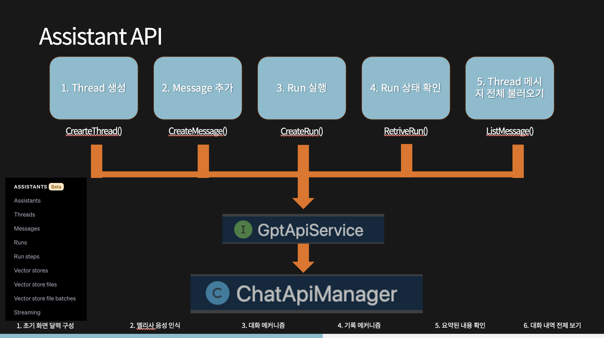
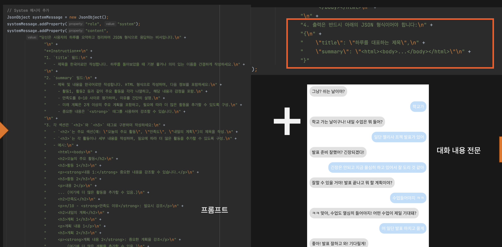

# Melissa

> AI와 대화하며 하루를 돌아보면, 그 대화를 일기로 자동 정리해 주는 Android 앱

일기를 쓰고 싶지만 시간과 귀찮음 때문에 못 쓰는 사람을 위해 만들었습니다.
빈 화면에 글을 쓰는 대신 AI가 먼저 말을 걸고, 사용자는 답만 하면 됩니다.
대화가 끝나면 제목, 주요 활동, 만족도, 다음 날 계획이 담긴 일기가 자동으로
만들어져 달력에 저장됩니다.

2024년 2학기 모바일프로그래밍 수업에서 4인 팀으로 진행한 프로젝트입니다.

## 화면

| 대화 | 채팅방 | 일기 조회 |
| --- | --- | --- |
|  |  |  |

왼쪽부터 AI가 먼저 질문을 건네는 대화 화면, 초기화와 요약하기 버튼이 있는
채팅방, 대화를 요약해 만든 일기를 날짜별로 보여주는 조회 화면입니다.

## 문제와 해결

일기의 필요성은 느끼지만 매일 밤 빈 페이지를 채우는 일은 부담스럽습니다.
Melissa는 기록하는 방식 자체를 바꿔서 이 부담을 없앱니다.

- 쓰지 않고 말합니다. AI가 "오늘 뭐 했어?" 하고 먼저 물어보고, 사용자는
  친구에게 답하듯 짧게 대답하며 하루를 정리합니다.
- 정리는 앱이 합니다. 대화가 끝나면 전체 대화를 요약해 제목과 본문이 있는
  일기로 만들어 저장합니다.
- 다시 꺼내 보기 쉽습니다. 달력에서 기록이 있는 날짜에 일기 제목이 표시되고,
  날짜를 누르면 일기와 당시 대화 전문을 볼 수 있습니다.

## 주요 기능

- 대화로 하루 기록: AI가 먼저 질문을 건네고 답변을 바탕으로 대화를
  이어갑니다. 앱을 껐다 켜도 같은 날에는 이전 대화가 이어집니다.
- 일기 자동 생성: 대화 전문을 프롬프트와 함께 요약 요청해 제목, 주요 활동,
  만족도(0~10), 내일의 계획이 담긴 일기를 만들어 저장합니다.
- 달력 기반 조회: 월 단위 달력을 좌우로 넘기며 탐색하고, 상단의 년, 월을
  누르면 원하는 달로 바로 이동합니다. 기록이 있는 날짜에는 일기 제목이
  표시됩니다.
- 웨이크워드 진입: 메인 화면에서 "멜리사"라고 부르면 음성 인식으로 바로
  채팅 화면에 들어갑니다.

## 기술 스택

| 구분 | 기술 |
| --- | --- |
| 언어, 빌드 | Java 8, Gradle 7.4, Android Gradle Plugin 7.3.0 |
| Android | minSdk 26, targetSdk 32, AppCompat, Material Components, ViewPager2, Fragment |
| 네트워크 | Retrofit2, OkHttp3, Gson |
| AI | OpenAI Assistants API, Chat Completions API |
| 음성 | Picovoice Porcupine 한국어 웨이크워드 모델 |
| 저장소 | SQLite, SharedPreferences |

## 시작하기

요구 환경: Android Studio, Android SDK 32

프로젝트 루트에 `local.properties`를 만들고 다음 값을 설정합니다.

```properties
sdk.dir=/path/to/Android/sdk
OPENAI_API_KEY=your_openai_api_key
PORCUPINE_ACCESS_KEY=your_picovoice_access_key
ASSISTANT_ID=your_openai_assistant_id
```

```bash
./gradlew assembleDebug       # 빌드
./gradlew testDebugUnitTest   # 단위 테스트
```

## 프로젝트 구조

```text
app/src/main/java/com/example/melissa/
├── activities/   # 달력 메인, 채팅, 일기 조회, 대화 전문 화면
├── adapters/     # RecyclerView와 ViewPager2 어댑터
├── database/     # SQLite 생성, 저장, 조회
├── fragments/    # 월별 달력 화면
├── models/       # 채팅 메시지 모델과 JSON 변환
├── network/      # OpenAI API 클라이언트 계층
└── utils/        # 대화 Thread 생명주기, 플로팅 버튼 관리
```

## 설계 결정

Assistants API로 대화 상태 관리

대화 맥락 유지를 서버 측 Thread에 맡기고, 앱은 메시지 전송과 조회만
담당하도록 했습니다. 한 번의 응답을 받기까지 Thread 생성, Message 추가,
Run 실행, Run 상태 확인, 메시지 조회의 단계를 순서대로 거칩니다.



네트워크 계층 분리

당시 Assistants API는 Android Java용 SDK가 제공되지 않아 HTTP 규격을 직접
분석해 클라이언트를 만들었습니다. 저수준 호출을 화면 코드에서 떼어내기 위해
GptApiService(엔드포인트 정의), RetrofitClient(인증과 설정),
ChatApiManager(비동기 래퍼), ThreadManager(Thread 생명주기)로 역할을
나눴습니다.

프롬프트로 출력 형식 고정

자유 형식의 AI 응답은 화면에 일관되게 보여주기 어렵기 때문에, 요약 요청 시
프롬프트로 출력을 `title`과 `summary`를 가진 JSON으로 제한하고 본문은 HTML로
받아 저장부터 렌더링까지 연결했습니다.



SQLite 로컬 저장

원래라면 서버에 저장해야 할 일기와 대화 기록을, 프로토타입 단계라는 점을
고려해 기기 내 SQLite에 저장하는 것으로 범위를 정했습니다.

새벽 4시 30분 하루 경계

앱을 다시 켜도 같은 날의 대화는 이어져야 해서 SharedPreferences에 Thread
정보를 저장하고, 사람들이 가장 많이 자는 시간대라고 판단한 새벽 4시 30분을
기준으로 새 대화 Thread를 시작하는 정책을 정했습니다.

## 어려웠던 점

가장 어려웠던 것은 Assistants API의 비동기 흐름이었습니다. 메시지를 보낸
직후에는 응답이 없고, Run이 완료 상태가 될 때까지 상태를 반복 조회한 뒤에야
응답을 가져올 수 있습니다. 콜백이 중첩되는 흐름 속에서 UI가 응답보다 먼저
갱신되거나 메시지가 누락되지 않도록 순서를 보장하는 설계에 가장 많은 시간을
썼습니다. 참고할 Android 예제가 거의 없어 공식 API 명세와 실제 JSON 응답을
직접 분석하며 구현했습니다.

## 프로젝트 정보

| 항목 | 내용 |
| --- | --- |
| 기간 | 2024.10.30 ~ 2024.12.04 |
| 형태 | 모바일프로그래밍 수업 4인 팀 프로젝트 |
| 담당 | 레이아웃과 화면 플로우 설계, 웨이크워드 메커니즘 구현 |

## 다음 이야기

이 프로토타입은 이후 별도 팀 프로젝트로 고도화되어 크로스플랫폼 앱으로
출시되었습니다.

- 고도화 프로젝트 저장소: https://github.com/orgs/team-Melissa/repositories
- Google Play: https://play.google.com/store/apps/details?id=com.melissa.melissaFE
